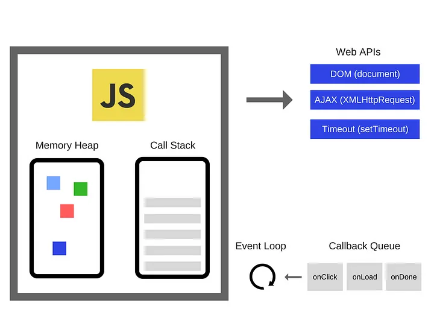

# JS 작동 원리

## JS 엔진의 특징

- 싱글 쓰레드 기반의 언어로 한번에 한 개의 작업만 수행할 수 있습니다.
- 하지만 한번에 여러개의 비동기작업을 처리할 수 있는데, 그게 가능한 이유는 Web API로 호출하는 작업은 브라우저가 담당해서 멀티 스레드로 동작시키기 때문입니다.

 

 

## 콜스택, 메모리 힙

자바스크립트 엔진의 메모리 모델을 구성하는 두 가지 영역이다.

- **콜스택 (call stack)** 은 실행 환경을 저장하는 영역이다. 스크립트 실행 전 전역 실행 환경을 push한 다음, 새로운 함수가 실행될 때마다 콜스택에 새로운 실행 환경을 push한다. 함수의 실행이 끝나면 pop을 한다. 실행 환경에는 식별자가 들어있으므로 참조 타입이 아닌 원시 타입 변수의 값은 이 곳에 저장되어 있다고 생각하면 된다.
- **메모리 힙 (memory heap)** 은 참조 타입 객체가 저장되는 곳이다.

참조 타입 변수의 저장에 대해 더 자세히 말하자면, 메모리 힙에는 메모리가 할당되어 실제적인 객체가 저장되어 있고, 콜스택에 있는 변수는 메모리힙에 할당된 주소를 가리킨다.

메모리 영역에서 더 이상 참조되지 않는 데이터는 `가비지 컬렉터`가 정리한다.

## 태스크 큐 (Task Queue)란?

- 콜백함수가 담겨있기 때문에 콜백 큐 (callback queue)라고 하기도 한다.
- Web API를 호출할 때 콜백함수도 같이 전달해주는데, Web API 작업을 마친 쓰레드는 콜백함수를 다시 되돌려줘서 콜백 큐(태스크 큐)에 저장한다.

## 이벤트 루프 (event loop)란?

콜 스택과 콜백큐(태스크 큐)를 감시하는 역할을 한다. 콜 스택이 비면 콜백큐에서 콜백함수를 가져와 콜스택에 push하는 역할을 한다.

## 전반적인 엔진 동작 예시

- `setTimeout(콜백함수, 시간)` 을 호출하면 setTimeout 작업(몇 초 대기하기) 뒤에 바로 콜백함수가 실행되는 것이 아니고 콜백함수를 태스크 큐에 집어넣다. 그리고 콜스택이 빈다면 이벤트 루프가 태스크 큐에 있던 콜백함수를 콜스택에 집어넣어 그때서야 콜백함수가 실행된다. 콜스택이 비기를 기다려야 하기 때문에 가끔 setTimeout을 지정한 시간보다 더 시간이 지나서 콜백함수가 실행될 때가 있는 것이다.

## Reference

- 이미지 출처: https://blog.sessionstack.com/how-does-javascript-actually-work-part-1-b0bacc073cf
- https://ko.javascript.info/event-loop
- [javascript] 콜스택/메모리힙 구조, 데이터 저장/참조 원리 | https://charming-kyu.tistory.com/19
- [JavaScript] 비동기 작업의 원리 (JavaScript 엔진, Web API, Task Queue, Event Loop) | https://it-eldorado.tistory.com/86
