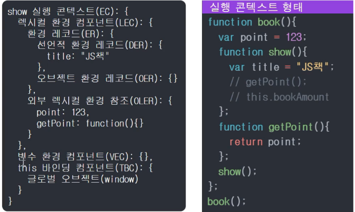

# 실행 컨텍스트와 클로저(closure)

## 스코프

### 스코프, 전역 변수, 지역 변수

스코프란 식별자 (변수, 함수, 클래스)에 접근할 수 있는 유효 범위이다.

- 전역 변수: 전역 변수는 global 변수라고도 한다. window 객체에 등록되기 때문에 어디에서든 접근할 수 있다.
- 지역 변수: 함수 내, 혹은 블록 범위 내에 선언된 변수이다. 해당 범위 바깥에서는 접근할 수 없다.

안쪽 스코프는 바깥 스코프에 접근할 수 있다. 스코프 중 지역 스코프가 우선한다.

## 실행 컨텍스트 (Execution Context)

- 실행 컨텍스트는 코드를 실행할 때 필요한 정보들을 모아놓은 객체이다. - 함수가 **실행** 될 때 실행 컨텍스트가 생성된다.
- 함수 내부의 변수, 외부의 변수, this 바인딩에 대한 정보를 갖고 있다.

 
렉시컬 환경 컴포넌트, 변수 환경 컴포넌트, this 바인딩 컴포넌트로 이루어져 있다.

- 렉시컬 환경 컴포넌트: 외부 식별자와 내부 식별자 정보를 갖고 있음. 변수 환경이 스냅샷인 것에 비해, 렉시컬 환경 컴포넌트는 변경되기도 함.
- 변수 환경 컴포넌트: 렉시컬 환경 컴포넌트와 같지만 처음 실행 시의 스냅샷을 갖고 있음.
- this 바인딩 컴포넌트: 식별자가 가리키는 대상(맥락)을 갖고 있음.

  

## 렉시컬 환경 (Lexical Environment)

실행 컨텍스트를 이루는 객체 중 하나이며, <u>함수 내에 선언된 식별자(변수, 함수)와 함수 밖의 영역에 있는 식별자들이 이곳에 저장되어 있다.</u>

함수의 스코프는 함수가 실행될 때가 아니라 함수 오브젝트를 만날 때 (선언부를 만날 때) 생성된다. 그래서 렉시컬 스코프를 정적 스코프라고도 한다.
-> 함수 밖의 스코프를 함수의 [[Scope]]에 저장하고 있다가, 함수가 실행될 때 실행 컨텍스트의 렉시컬 환경 객체 안의 외부 렉시컬 환경 참조에 할당한다.

## 클로저

어떤 함수의 내부에 새로 함수를 정의한 다음, 그 함수를 반환하며 원래 있던 함수가 종료되어도, 반환된 함수는 이미 종료된 함수의 변수에 접근할 수 있는 것을 클로저(Closure)라고 한다. 요약하자면 자신이 생성될 때의 외부 환경(Lexical Environment)을 기억하고 있는 함수라고 할 수 있다.

### 클로저의 활용 예

변수의 은닉화를 할 때 유용하게 사용된다. 함수의 내부에 private으로 사용할 변수를 정의한 다음, 그 변수를 참조하는 로직은 내부에 정의한 다른 함수가 담당하도록 하고 그 함수만 반환한다. 그러면 바깥에서는 반환된 함수를 통해서만 변수에 접근할 수 있다.

## Reference

- 이미지 출처- 인프런 > 김영보님의 [자바스크립트 중고급: 엔진 핵심] 강의 > 중고급 강좌 소개, 범위 > 3. Execution Context 형태
- 자바스크립트 실행 컨텍스트 | https://junilhwang.github.io/TIL/Javascript/Domain/Execution-Context/#_3-environmentrecord%E1%84%8B%E1%85%AA-hoisting-%E1%84%92%E1%85%A9%E1%84%8B%E1%85%B5%E1%84%89%E1%85%B3%E1%84%90%E1%85%B5%E1%86%BC
- 실행 컨텍스트란 무엇인가요? | https://velog.io/@edie_ko/js-execution-context
- [JavaScript] 렉시컬 환경 | https://developer-alle.tistory.com/407
- 함수의 범위(scope) | https://www.zerocho.com/category/Javascript/post/5740531574288ebc5f2ba97e
- PoiemaWeb - 클로저 | https://poiemaweb.com/js-closure
- JavaScript 클로저(Closure) - _(클로저의 사용 예시와 코드를 설명하고 있다.)_ | https://hyunseob.github.io/2016/08/30/javascript-closure/
