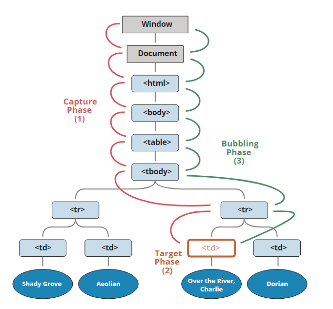

# 이벤트 버블링과 캡처링

## 이벤트 버블링과 캡처링이란?

### 요약

- 버블링: 이벤트가 아래에서부터 위로 전파되는 것
- 캡처링: 이벤트가 위에서 아래로 전파되는 것

### 이벤트 버블링과 캡처링을 설정하는 방법

`addEventListener('이벤트종류', '콜백함수', { capture: true/false })`  
세번째 인자에 `capture: true`를 주면 캡처링, `false`를 주면 버블링. 세번째 인자는 아무것도 주지 않으면 false인 버블링이 디폴트값이다.

## event.target VS event.currentTarget

- event.target은 이벤트가 발생한 요소를 가리키고,
- event.currentTarget은 이벤트가 부착된 요소를 가리킨다.

`<button>` 내부에 ``태그가 있고, `<button>`에 이벤트가 부착되어 있을 때, ``을 클릭해서 이벤트가 발생했을 때ㅇ,; event.target은 ``이 되고, event.currentTarget은 `<button>`이 된다.

## 이벤트 버블링과 캡처링 사용 예시 - 이벤트 위임

이벤트 위임(Event Delegation)에 이용할 수 있다.
리스트처럼 하위 요소에 모두 따로 이벤트를 등록하기 번거로운 상황에서, 상위 요소 하나에만 이벤트를 등록하고 event.currentTarget과 조건문을 이용해 이벤트를 실행하도록 할 수 있다.

## JS 이벤트 흐름 - 캡처링과 버블링이 둘 다 등록되어 있다면?

 
이벤트는 캡처링 단계를 거쳐서 타깃에 도달하고, 버블링을 통해 위로 전파되는 과정을 거친다.  
따라서 어떤 요소에 캡처링과 버블링으로 이벤트를 동시에 설정하면 먼저 캡처링 과정을 따라 하위 요소로 내려온 뒤, 타깃을 두 번 실행하고, 상위 요소로 타고 올라가는 버블링이 일어난다.  
[여기](https://ko.javascript.info/bubbling-and-capturing#ref-535)에 좋은 예시가 있다.

 

## Reference

- 이벤트 버블링, 이벤트 캡처 그리고 이벤트 위임까지 | 캡틴판교 - https://joshua1988.github.io/web-development/javascript/event-propagation-delegation/#%EC%9D%B4%EB%B2%A4%ED%8A%B8-%EB%B2%84%EB%B8%94%EB%A7%81---event-bubbling
- [이미지 출처] 버블링과 캡처링 - https://ko.javascript.info/bubbling-and-capturing
