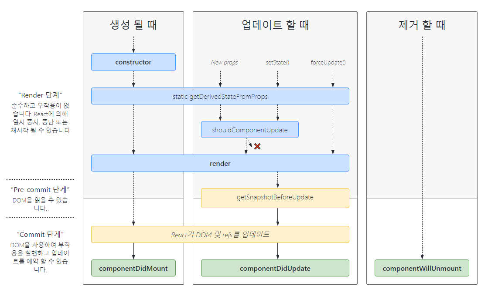

# 컴포넌트 생명주기 (Component LifeCycle)

## 생명주기 메서드에 대해 설명해주세요.

컴포넌트는 크게 세 가지 라이프사이클을 거친다.
컴포넌트 생성(Mount) -> 업데이트(Update) -> 제거(Unmount)

Mount란 컴포넌트가 트리에 삽입되는 것, Unmount는 제거되는 것을 의미한다.

아래 표에 나온 것 중 굵은 글씨로 표시된 것과 **shouldComponentUpdate**만 알면 된다.



<br/>

---

### **constructor()**

컴포넌트가 마운트 되기 전에 실행되는 함수이다.
`super(props)` 호출을 한 다음 함수 바인딩, state 초기화 작업을 이 안에서 한다. 만약 함수 바인딩이나 state 초기화를 할 필요가 없다면 constructor()를 호출하지 않아도 된다.

- `super(props)`를 하는 이유: `super()`는 자식 클래스에서 부모 클래스의 생성자를 호출하는 메소드이다. React.Component의 생성자를 호출하면서 props를 넘겨줌으로써 부모 컴포넌트(React.Component)의 this.props에 props를 할당한다.
- constructor()에서 `this.handleIncrease = this.handleIncrease.bind(this);`처럼 메소드를 정의하면서 바인딩해줘야 하는 이유: props로 자식컴포넌트에 메소드를 내려주면 부모 컴포넌트에서 작성한 메소드 내부의 this가 가리키는 맥락(부모 컴포넌트)가 이어지지 않고 끊어진다. 자식컴포넌트에서 this.setState로 부모의 상태를 바꿀 때처럼 this가 부모 컴포넌트를 가리킬 필요가 있기 때문에 바인딩하는 것이다.

### **render()**

React 엘리먼트를 반환한다. 마운트 되기 전 뿐만 아니라 컴포넌트 업데이트 전에도 실행된다.  
render() 함수는 순수해야 한다.
-> render() 함수 내에서는 state를 변경하면 안되고, 항상 같은 값을 반환해야 한다.

---

### **componentDidMount()**

트리에 처음으로 노드가 삽입되고 난 뒤에 한번만 실행된다.
데이터를 가져오거나 트리에 노드가 이미 존재해야 할 수 있는 작업을 이 곳에서 수행한다.

---

### **shouldComponentUpdate()**

- state나 props가 변경될 때, 컴포넌트가 리렌더링되어야 하는지 판단하는 메소드이다.
- true를 반환하면 업데이트, false면 업데이트를 하지 않는데, 조건에 따라 이 값을 줘서 업데이트 할지를 결정할 수 있다.
- 따로 이 메소드를 작성하지 않으면 기본적으로 true값을 반환하므로 props나 state가 변경되면 무조건 리렌더링을 하게 된다.
- <u>성능 최적화</u>를 위한 함수이므로 업데이트를 방지하는 목적으로 사용하면 버그로 이어질 수 있다.

```js
shouldComponentUpdate(nextProps, nextState) {
  // 숫자의 마지막 자리가 4면 리렌더링하지 않는다.
  return nextState.number % 10 !== 4;
}
```

### **componentDidUpdate()**

- 업데이트가 일어난 직후에 수행된다. props나 state의 변화로 리렌더링이 일어난 다음, 변경된 props나 state로 인해 새로운 데이터를 가져올 필요가 있거나 추가 작업을 해야 할 때 사용한다.
- 조건문을 작성하지 않고 state를 바꾸는 작업을 하면 무한 리렌더링이 일어날 수 있으므로 주의해야 한다.
- 이전 props, state, getSnapshotBeforeUpdate의 반환값을 조회할 수 있다.

```js
componentDidUpdate(prevProps) {
  // 전형적인 사용 사례 (props 비교를 잊지 마세요)
  if (this.props.userID !== prevProps.userID) {
    this.fetchData(this.props.userID);
  }
}
```

```js
componentDidUpdate(prevProps, prevState, snapshot) {
  console.log("componentDidUpdate", prevProps, prevState);
  if (snapshot) {
    console.log("업데이트 되기 직전 색상: ", snapshot);
  }
}
```

---

### **componentWillUnmount**

- 컴포넌트가 DOM에서 제거될 때 호출된다.
- 주로 등록해놓은 time 관련 함수나 이벤트리스너를 이 곳에서 제거한다.

<br /><br />

## shouldComponentUpdate에 대해 설명해주세요.

성능 최적화를 위한 함수이다. state나 props 값이 변경되면 리액트는 기본적으로 리렌더링을 하는데, 불필요한 리렌더링을 줄이고 싶을 때 조건문을 통해서 true나 false 값을 반환하면 무조건적인 리렌더링을 방지할 수 있다. 다만 성능 최적화를 위한 함수이므로 리렌더링 방지용으로 쓴다면 에러가 발생할 수 있다.

<br /><br />

## Pure component에 대해 설명해주세요.

- `React.PureComponent`는 `React.Component`의 하위 클래스이며 다른 것은 다 같지만, `shouldComponentUpdate`를 따로 작성하지 않아도 알아서 최적화를 수행한다는 차이가 있다.
- state나 props가 바뀌지 않았다면 리렌더링하지 않는데, 값을 비교할 때는 얕은 비교(일반 값은 값으로, object는 주소로)를 하기 때문에 자료구조가 복잡하다면 값이 바뀐 것을 인식하지 못할 수도 있다.
- Pure Component를 상속하지 않고도 Component에서 같은 기능을 사용하는 방법은 React.memo()로 감싸는 것이다.
- React.memo()는 HOC(컴포넌트 wrapper 컴포넌트)이므로 클래스형과 함수형 컴포넌트에서 둘 다 사용할 수 있다. 함수형 컴포넌트에서 최적화를 하고 싶다면 React.memo()나 useMemo() hook을 사용하면 된다.

## 왜 state를 직접 바꾸지 않고 useState()를 사용해야 하나요?

state를 직접 변경하면 내부의 값은 바뀌어도 state 객체의 주소는 그대로이다. 컴포넌트는 얕은 비교를 하기 때문에 직접 변경하면 값이 바뀌었는지 알기 어렵다. 따라서 useState()로 새 객체를 만들어 할당하는 것이다.

## Reference

- 생명주기 도표 출처: https://projects.wojtekmaj.pl/react-lifecycle-methods-diagram/
- reactjs > React.Component 문서 - https://ko.reactjs.org/docs/react-component.html
- React bind는 왜, 언제 쓰는가? - https://m.blog.naver.com/PostView.naver?isHttpsRedirect=true&blogId=dilrong&logNo=221542329638
- [React] 생명주기 (LifeCycle) - https://velog.io/@yhd520/React-%EC%83%9D%EB%AA%85%EC%A3%BC%EA%B8%B0-LifeCycle
- reactjs beta > - https://beta.reactjs.org/reference/react/PureComponent

+) 생명주기 관련 정보를 찾을 때는 `componentWillMount`, `componentWillUpdate`, `componentWillReceiveProps`에 대해 설명하고 있는 글은 거르자. React 17부터 deprecated된 메서드들이다. 이제는 `UNSAFE_componentWillMount` 처럼 앞에 UNSAFE가 붙고 사용이 권장되지 않는다.
